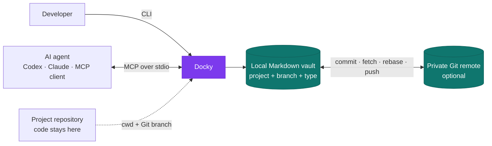

<div align="center">

# ⚓ Docky

### A local-first Markdown vault for humans and AI coding agents

Keep specs, plans, decisions, and project memory out of your source repositories—without losing search, history, branch context, or agent access.

[](https://github.com/Alwaysdebugg/docky)
[](#development)
[](package.json)
[](tsconfig.json)
[](#connect-an-ai-agent)
[](LICENSE)

[Quick start](#quick-start) · [How it works](#how-it-works) · [Cloud Sync](#cloud-storage--sync) · [MCP](#connect-an-ai-agent) · [CLI](#command-reference) · [Contributing](#contributing)

</div>

---

## Why Docky?

AI coding agents create valuable process documents: principles, specifications, implementation plans, task lists, architecture decisions, and shared terminology. Keeping all of them inside application repositories creates three recurring problems:

- source history fills with documentation churn;
- knowledge becomes scattered across repositories and branches;
- agents load unrelated context and make worse decisions.

Docky stores those documents in a dedicated, versioned Markdown vault. The CLI gives humans a fast interface; the MCP server gives agents scoped read and write tools. Your application repositories stay focused on code.

> **Local first by design.** Your files live on your machine, remain readable with ordinary tools, and can optionally sync through a private Git remote.

## Highlights

| | Capability | What it gives you |
|---|---|---|
| 🧭 | **Automatic project detection** | Resolves the project from the current directory, Git root, and branch. |
| 🔒 | **Hard scope isolation** | Every tool call is confined to one project and branch; path escapes are rejected. |
| 🧠 | **Agent-ready context** | Ranked search and budget-bounded context bundles reduce noisy MCP round trips. |
| 🌿 | **Branch-aware documents** | Work on one branch without leaking documents from another branch into agent context. |
| 🗂️ | **Named workspaces** | Keep personal, work, and client vaults isolated on the same device. |
| ☁️ | **Optional Cloud Sync** | Synchronize through a private Git remote with offline-safe commits and conflict detection. |
| 🕰️ | **Recoverable history** | Vault writes can be auto-committed, so previous document versions remain available in Git. |
| 🤝 | **Governed sharing** | Explicit read-only grants allow selected cross-project context without removing isolation. |
| ✍️ | **Safe agent writes** | Duplicate detection and explicit append/replace/merge modes prevent silent overwrites. |
| 🔌 | **CLI + MCP** | Use Docky directly or connect Codex, Claude Code, and other MCP clients. |

## How it works



Documents are stored in a predictable hierarchy:

```text
~/docky-vault/
├── .docky/
│   ├── config.yaml          # safe, shareable configuration
│   └── local.yaml           # device paths and preferences; Git-ignored
└── projects/
    └── my-app/
        └── branches/
            └── feat/
                └── login/
                    ├── constitution/
                    ├── spec/
                    ├── plan/
                    ├── tasks/
                    ├── adr/
                    └── glossary/
```

Git does not track empty directories, so a type directory appears in the remote after its first document is created.

## Requirements

- Node.js 18 or newer
- Git
- An MCP-compatible client if you want agent integration
- A private Git remote if you want Cloud Sync

## Installation

Docky is currently installed from source:

```bash
git clone https://github.com/Alwaysdebugg/docky.git
cd docky
npm install
npm link
```

This installs two commands:

```text
docky       Human-facing CLI
docky-mcp   Local MCP server over stdio
```

You can also install globally from an existing checkout:

```bash
npm install -g .
```

## Quick start

From a project you want Docky to manage:

```bash
docky setup
```

This initializes the default vault, registers the current project, installs the project-level Claude Code hooks, and prints the MCP connection command.

Try the core workflow:

```bash
docky new spec login-timeout
docky list spec
docky search "session timeout"
docky open spec/login-timeout.md
```

Docky detects the project and current Git branch from your working directory.

## Connect an AI agent

### Codex

```bash
codex mcp add docky -- docky-mcp
codex mcp list
```

Restart the Codex client after adding the server. If your desktop app does not inherit the shell PATH, configure the absolute paths to Node.js and `dist/mcp.js` instead.

### Claude Code

```bash
claude mcp add --scope user docky -- docky-mcp
```

### Generic MCP client

```json
{
  "mcpServers": {
    "docky": {
      "command": "docky-mcp"
    }
  }
}
```

### MCP tools

| Tool | Purpose |
|---|---|
| `resolve_project` | Resolve a working directory to its registered project and Git branch. |
| `list_docs` | List documents by type, lifecycle status, or tag. |
| `read_doc` | Read one scope-checked document. |
| `search_docs` | Run relevance-ranked search with highlighted snippets. |
| `write_doc` | Create, append, preview-merge, or explicitly replace a document. |
| `get_context` | Return a ranked document bundle within a token budget. |

The server also exposes documents as MCP resources and provides one scaffold prompt per document type.

## Document types

Docky uses a small, fixed taxonomy so humans and agents agree on where knowledge belongs and how carefully it should be reviewed.

| Type | Use it for | Review policy |
|---|---|---|
| `constitution` | Long-lived principles and hard constraints | Review deeply when written |
| `spec` | Requirements and acceptance criteria | Review every time |
| `plan` | Implementation design and execution approach | Spot-check against the constitution |
| `tasks` | Disposable execution checklists | No formal review |
| `adr` | Architecture decisions, reasons, and tradeoffs | Review every time |
| `glossary` | Shared project terminology | Review new entries |

Each type has a built-in scaffold. To override one, create `templates/<type>.md` inside the vault. Docky never writes that directory itself.

## Workspaces

Named workspaces isolate vaults for different contexts:

```bash
docky workspace add personal ~/docky-personal
docky workspace add work ~/docky-work
docky workspace list
docky workspace use work
```

Run one command against another workspace without changing the default:

```bash
docky --workspace personal list
```

The registry lives at `~/.docky/workspaces.yaml` and remains device-local. An MCP server captures its active workspace at startup, so restart the client after switching the default.

## Cloud Storage & Sync

Run the guided setup:

```bash
docky cloud setup
```

Or configure a specific workspace:

```bash
docky --workspace work cloud setup
```

The wizard guides you through workspace selection, Vault initialization, Git Remote, branch, the Cloud Sync switch, configuration review, and an optional first sync.

For scripts and automation:

```bash
docky cloud connect git@github.com:you/docky-vault.git --branch main
docky cloud on
docky sync
```

The synchronization pipeline is intentionally conservative:

```text
local write → local commit → fetch → rebase → push
```

- Local changes are committed before network access.
- Network failures preserve the local commit for a later retry.
- Rebase conflicts are recorded, then aborted so the local document remains intact.
- `docky cloud off` prevents the Cloud Sync engine from contacting the remote.
- `docky cloud status` reads local state and never contacts the remote.
- `docky sync --all` syncs every initialized workspace with Cloud Sync enabled.

Automatic synchronization currently runs when the MCP server starts and after a successful MCP document write. Changes made through the CLI or directly in the Vault are uploaded on the next `docky sync`.

The legacy `docky sync --push` option can still push a separately configured Git upstream while Cloud Sync is off.

## Claude Code hooks

Docky can make process-document handling the default behavior in Claude Code:

```bash
docky hooks install
docky hooks install --user
```

The hooks:

- inject the Docky policy, review rules, and current document list at session start;
- stop agent-generated process Markdown from being written into the application repository;
- leave standard repository files such as `README.md` and `CHANGELOG.md` alone.

Hook installation is idempotent and preserves unrelated entries in `.claude/settings.json`.

## Command reference

Run `docky <command> --help` for complete options.

| Area | Commands |
|---|---|
| Setup | `setup`, `uninstall`, `init` |
| Workspaces | `workspace add`, `workspace list`, `workspace use` |
| Projects | `register`, `projects`, `whoami` |
| Create and import | `new`, `add` |
| Find and read | `list`, `search`, `open` |
| Lifecycle | `status`, `mv`, `rm` |
| Sharing | `grant`, `revoke`, `grants` |
| Cloud | `cloud setup`, `cloud connect`, `cloud on`, `cloud off`, `cloud status`, `sync` |
| Configuration | `config` |
| Migration | `migrate-branch-scope`, `migrate-types` |
| Agent integration | `hooks install`, `hooks uninstall` |

<details>
<summary><strong>Migration notes</strong></summary>

### Older document types

```bash
docky migrate-types
docky migrate-types --apply
```

The dry run reports moves first. Applying the migration maps `design` to `plan` and parks retired `debug`, `code-review`, and `prompts` documents under `_legacy/` without overwriting occupied destinations.

### Legacy flat branch layout

```bash
docky migrate-branch-scope
docky migrate-branch-scope --branch feat/login
```

This command applies the migration immediately and relocates legacy project documents into `projects/<name>/branches/<branch>/`.

</details>

## Safety model

Docky treats the Vault as durable user data:

- read and write paths must stay inside the resolved project scope;
- cross-project access is denied unless an explicit read-only grant exists;
- destructive uninstall requires both `--purge-vault` and `--yes`;
- duplicate agent writes return a suggestion instead of silently overwriting;
- local project paths and device preferences are excluded from cloud commits;
- Git history remains available for recovery after ordinary writes and deletes.

## Development

```bash
npm install
npm run build
npm test
```

Useful development commands:

```bash
npm run dev -- list
npm run mcp
```

The test suite uses [Vitest](https://vitest.dev/) and currently contains 140 tests. Cloud Sync integration tests create temporary local and bare Git repositories to exercise real commit, fetch, rebase, and push behavior.

## Contributing

Contributions are welcome. A focused pull request is the easiest to review:

1. Fork the repository and create a feature branch.
2. Install dependencies with `npm install`.
3. Make the change and add meaningful tests where behavior changes.
4. Run `npm run build` and `npm test`.
5. Open a pull request describing the problem, behavior change, and verification.

Use [GitHub Issues](https://github.com/Alwaysdebugg/docky/issues) for bugs and feature proposals. Please search existing issues before opening a new one.

## Security

Please do not publish suspected vulnerabilities in a public issue. Report them through [GitHub private vulnerability reporting](https://github.com/Alwaysdebugg/docky/security/advisories/new).

## Project status

Docky is at **v0.1.0** and under active development. The storage format is plain Markdown and Git so your documents remain portable while the interfaces evolve.

## License

Docky is available under the [MIT License](LICENSE).

<div align="center">

Built for developers who want AI-generated project memory to stay useful.

</div>
